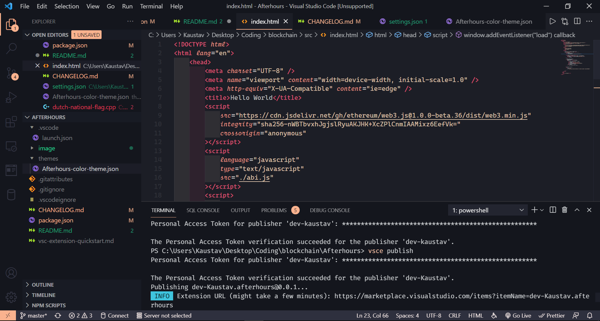
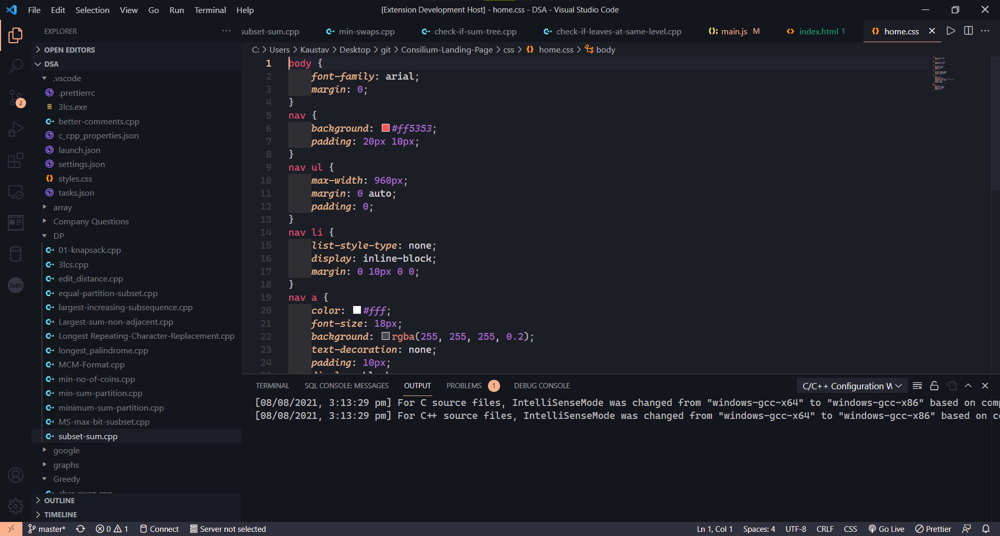
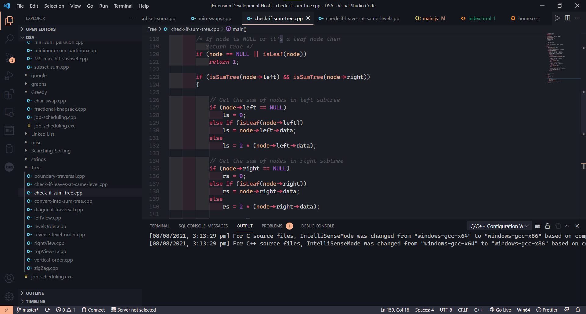

# Afterhours Theme

### Screenshots

##### HTML

##### CSS

##### JS

##### C++

### Description

Afterhours is a dark Visual Studio Theme inspired by the great [Horizon](https://https://marketplace.visualstudio.com/items?itemName=jolaleye.horizon-theme-vscode#:~:text=Search%20for%20Horizon%20Theme,Enjoy!) theme but adding some personal taste customizations.

The most important differences regarding Horizon theme are:

-   Editor (active tab) "virtually" floating over the window
-   Most divisions removed
-   Darker terminal, sidebar and titlebar
-   Optimised for programming languages

### For more information

-   [Visual Studio Code's Markdown Support](http://code.visualstudio.com/docs/languages/markdown)
-   [Markdown Syntax Reference](https://help.github.com/articles/markdown-basics/)

### License

[MIT](https://github.com/mtdmali/daybreak-theme/blob/master/LICENSE) © [Kaustav](https://github.com/dev-kaustav)
